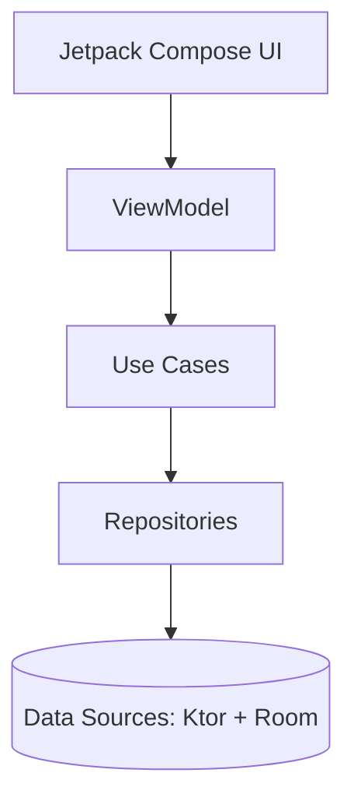

# ⚽ Soccerino

**Soccerino** is a modular Android application built with **Kotlin**, **Jetpack Compose**, and **Clean Architecture** principles.  
It demonstrates modern Android development best practices — including dependency injection with Hilt, reactive data flows using Kotlin Coroutines and Flow, and a clear separation of concerns across multiple Gradle modules.

---

## 🧩 Project Structure

```
rootProject.name = "Soccerino"

├── app                     # Application module (entry point)
├── core
│   ├── di                  # Dependency injection modules
│   ├── common              # Shared utilities, constants, and helpers
│   ├── domain              # Use cases and domain models
│   ├── data                # Repository implementations and data sources (network + local)
│   └── ui                  # Common Compose UI components and themes
│
├── feature
│   ├── ranking             # Feature module for player rankings and sorting
│   ├── following           # Feature module for followed players
│   └── player              # Feature module for player details and interactions
│
└── build-logic             # Custom Gradle convention plugins
```

---

## 🧠 Architecture

Soccerino follows **Clean Architecture** and **MVVM**, ensuring testability, maintainability, and scalability.



### Layers
- **UI Layer (Compose + ViewModel):** Displays reactive UI backed by state flows.
- **Domain Layer:** Encapsulates business logic via `UseCase` classes, e.g. `GetPlayersUseCase`.
- **Data Layer:** Implements repositories communicating with remote (Ktor) and local (Room) data sources.
- **DI Layer:** Provides dependency bindings and configuration using Hilt modules.

---

## 🧰 Tech Stack

| Category             | Technology                                              |
|----------------------|---------------------------------------------------------|
| Language             | **Kotlin**                                              |
| UI                   | **Jetpack Compose**                                     |
| Architecture         | **Clean Architecture**, **MVVM**, **Multi-module**      |
| Dependency Injection | **Hilt (Dagger)**                                       |
| Networking           | **Ktor Client**                                         |
| Local Persistence    | **Room**                                                |
| Async                | **Kotlin Coroutines**, **Flow**                         |
| Navigation           | **Navigation Component**                                |
| Testing              | **JUnit**, **Mockk**, **Kotest**, **Hilt Android Test** |
| Build System         | **Gradle Kotlin DSL**                                   |
| Minimum SDK          | 23                                                      |
| Target SDK           | 36                                                      |
| JVM Target           | 11                                                      |

---

## ⚙️ Setup & Installation

### 1. Clone the repository
```bash
git clone https://github.com/<your-username>/Soccerino.git
cd Soccerino
```

### 2. Configure `gradle.properties`

Before building, make sure the following values exist in your **`gradle.properties`** file:

```properties
COMPILE_SDK=36
MIN_SDK=23
TARGET_SDK=36
JVM_TARGET=11
```

### 3. Open in Android Studio
- Use **Android Studio Ladybug | 2024.2.1** or newer.
- Sync Gradle when prompted.

### 4. Run the app
- Choose a device (API 23+)
- Click **Run ▶️**

---

## 🧪 Testing

The project includes both **unit tests** and **instrumentation tests**.

Tests use:
- **Mockk** for mocking dependencies
- **Kotest** for expressive assertions
- **Hilt test environment** for dependency injection during Android tests

Example testable use case:
```kotlin
class GetPlayersUseCase @Inject constructor(
    private val repository: PlayerRepository
) {
    suspend operator fun invoke(
        sortBy: PlayerSortOption = PlayerSortOption.DEFAULT,
        offset: Long = 0,
        limit: Int = 2
    ): Resource<List<LeagueWithPlayers>> {
        return repository.getPlayers(sortBy, offset, limit)
    }
}
```

---

## 🏗️ Build Logic

The project uses a **composite build** with a `build-logic` module for shared Gradle convention plugins.  
These plugins centralize configuration for Compose, Hilt, and testing setup — reducing boilerplate and improving consistency across feature modules.

---

**Made with ❤️ using modern Android development practices.**